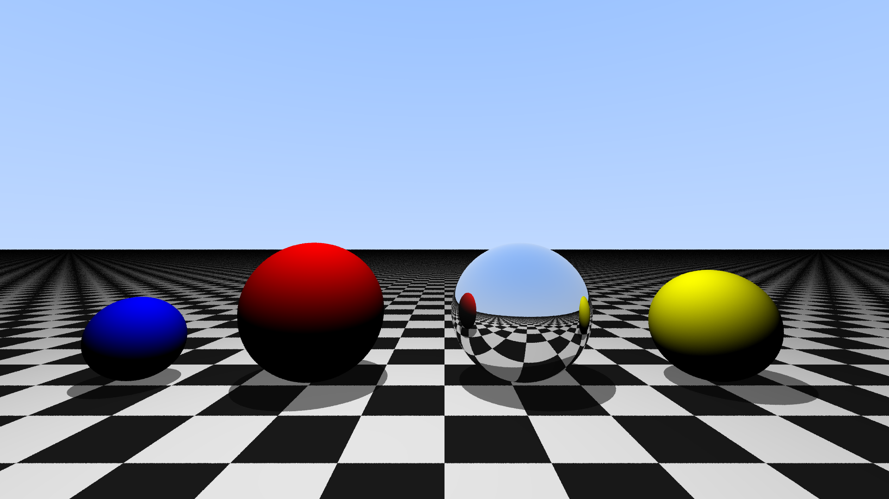

# cuTrace (CUDA / C++)

A GPU-accelerated ray tracer built from scratch. Includes core rendering logic (reflections, shadows, anti-aliasing), optimizations using Nsight, CPU/GPU benchmarking and CMake for build automation.

## Project Features

* 💡 Ray tracer with reflections shadows, and anti-aliasing 
* 🕹️ 3 render paths (CPU, GPU, Opt. GPU)
* 🚀 One command builds, renders, and displays the result
* ⚙️ CLI configurability for resolution and render path
* 📈 Automated benchmarks with warmup runs and repeated trials
* 🧩 Modular file structure separating rendering logic, kernels, and CPU path
* 📁 Clean folder structure and CMake build automation
* 📐 Documented math derivations

## Rendered Output (NVIDIA Tesla T4, 1920 x 1080)



## Project Structure

```
cuTrace/
├── CMakeLists.txt
├── render.sh
├── .gitignore
├── .gitattributes
├── LICENSE
├── README.md
├── src/
│   ├── main.cu
│   ├── gpu_naive.cu
│   ├── gpu_optimized.cu
│   └── cpu_render.cu
├── include/
│   ├── vec3.cuh
│   ├── ray.cuh
│   ├── sphere.cuh
│   ├── intersect.cuh
│   └── render.cuh
├── benchmark/
│   ├── benchmark.sh
│   ├── generate_report.py
│   └── benchmark_results.md
└── docs/
    ├── derivations.md
    └── Tracing.png
```

## Prerequisites

- NVIDIA GPU (not needed for --mode cpu)
- CUDA Toolkit 12.x or newer
- C++17 compatible compiler (usually installed automatically with the CUDA Toolkit)
- Python 3
- CMake 3.18+
- Bash
- ImageMagick (converts ppm to png)

## Setup

**Option A: Manually Build + Execute**


```bash
git clone https://github.com/MohamedFouad132/cuTrace.git
cd cuTrace
mkdir build && cd build
cmake ..
make
./raytracer [Flags]
convert output.ppm output.png
```

**Option B: Use `render.sh` to Build + Execute**


```bash
git clone https://github.com/MohamedFouad132/cuTrace.git
cd cuTrace
chmod +x render.sh
./render.sh [Flags]
```

**Flags**
```
--width <n>     Image width in pixels (default: 1920)
--height <n>    Image height in pixels (default: 1080)
--mode <mode>   Render path: cpu, gpu, gpu-optimized (default: gpu)
--benchmark     Write precise render time to benchmark/last_render_time.txt
--help, -h      Show usage information
```

Open `output.png` to view result.

## Benchmarks

To benchmark across all modes and resolutions

```bash
cd benchmark
chmod +x benchmark.sh
./benchmark.sh
```

**Example**:

Results below were generated on an NVIDIA Tesla T4 (Google Colab), 5 runs per
configuration plus 1 discarded warmup run:

| Resolution | Mode | Mean (ms) | StdDev (ms) | Min (ms) | Max (ms) | Speedup vs CPU |
|---|---|---|---|---|---|---|
| 640x480 | cpu | 5637.15 | 289.56 | 5310.82 | 5936.58 | 1.00x |
| 640x480 | gpu | 0.58 | 0.09 | 0.52 | 0.73 | 9655.29x |
| 640x480 | gpu-optimized | 0.21 | 0.01 | 0.20 | 0.22 | 26869.14x |
| 1280x720 | cpu | 16754.71 | 102.40 | 16616.92 | 16894.61 | 1.00x |
| 1280x720 | gpu | 0.80 | 0.05 | 0.76 | 0.86 | 20919.33x |
| 1280x720 | gpu-optimized | 0.37 | 0.01 | 0.35 | 0.39 | 45207.24x |
| 1920x1080 | cpu | 37566.65 | 169.20 | 37364.15 | 37764.48 | 1.00x |
| 1920x1080 | gpu | 1.29 | 0.20 | 1.13 | 1.62 | 29165.75x |
| 1920x1080 | gpu-optimized | 0.71 | 0.07 | 0.63 | 0.80 | 52921.21x |
| 3840x2160 | cpu | 149179.43 | 509.02 | 148639.97 | 149768.79 | 1.00x |
| 3840x2160 | gpu | 3.85 | 0.41 | 3.54 | 4.55 | 38778.52x |
| 3840x2160 | gpu-optimized | 3.14 | 0.23 | 3.01 | 3.55 | 47504.83x |

## Optimizations:

**Problem:** Theoretical occupancy  was capped at 75% due to register pressure (68 registers/thread, 3 resident blocks/SM vs a 4-block ceiling)

**Solution:** Replaced `curandState` with a lightweight LCG. Register pressure dropped enough to reach 100% theoretical occupancy (~70% → ~90% achieved).

**Problem:** Shadow rays used `hit_scene`, which finds the closest blocker even though shadows only need a yes/no answer

**Solution:** Replaced with `hit_anything`, an early-exit check that returns on the first blocker found

**Problem:** `spheres[hit_index]` was read from global memory up to 5 times per bounce, and accessed per-thread with a varying index (uncoalesced, 4 of 32 bytes/sector utilized)

**Solution:** Cached the hit sphere's data in a local variable, and moved the sphere array into shared memory to reduce redundant global reads

**Investigated and ruled out:** Warp divergence was hypothesized as a risk given variable bounce depth, but Nsight showed 99.47% branch efficiency. This is likely because the scene is not very complex (only 4 objects)

**Results:** The  optimized kernel was faster than baseline at every tested resolution:

`640×480: 2.76x`

`1280×720: 2.16x`

`1920×1080: 1.82x`

`3840×2160: 1.23x`

`Average: 1.99x`


## Derivations

Full derivations for the intersection and reflection formulas: [docs/derivations.md](docs/derivations.md)

## License

MIT License: [LICENSE](LICENSE)


